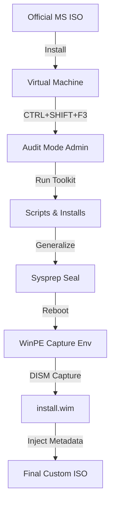

# Windows 10 IoT LTSC – Rapid Deployment Kit

## ⚠️ LEGAL DISCLAIMER

This repository **DOES NOT** contain Microsoft Windows binaries, ISO files, or illegal activation scripts. It contains only the configuration files, scripts, and documentation required to build your own custom image using legitimate Microsoft media. You must provide your own legally obtained Windows ISO.

---

## Table of Contents

- Project Overview  
- Workflow Architecture  
- Features & Software Stack  
- Prerequisites  
- Build Guide (Step-by-Step)  
- Repository Structure  
- Credits  

---

## Project Overview

The goal of this project is to eliminate **"setup fatigue"** for IT professionals and system builders. This toolkit creates a **"Golden Image"** of **Windows 10 IoT Enterprise LTSC 2021** designed for maximum performance, low latency, and zero post-install setup.

Instead of spending hours installing drivers and software on every new machine, this ISO provides a turn-key experience the moment it boots.

- **Base OS:** Windows 10 IoT Enterprise LTSC 2021  
- **Target Audience:** System Builders, IT Admins, Power Users  
- **Optimization Strategy:** Native debloat (no 3rd party breakers), Group Policy hardening, registry tweaks  

---

## Workflow Architecture

This diagram illustrates the **Audit Mode pipeline** used to create the image.



## Features & Software Stack

The image is engineered to be lightweight yet fully featured. All bloatware is removed while preserving system stability.

Pre-Installed Software

## ✨ Features & Software Stack

This image is deliberately engineered to strike a balance between minimalism and practicality. Non‑essential components and consumer bloat are removed using native methods, while core Windows functionality, update compatibility, and long‑term stability are fully preserved.

### 📦 Pre-Installed Software

| Application        | Category      | Notes                               |
|-------------------|--------------|-------------------------------------|
| Google Chrome      | Browser       | Latest Enterprise Build             |
| Microsoft Office   | Productivity  | Pre-loaded (License required)       |
| VLC Media Player   | Media         | Default Video/Audio Handler         |
| Notepad++          | Development   | Replaces stock Notepad              |
| 7-Zip              | Utility       | Associated with all archive types   |
| Visual C++ AIO     | Runtimes      | 2005–2022 Redistributables          |
| DirectX            | Gaming        | June 2010 Runtimes (Legacy Support) |

---

### ⚙️ System Optimizations

- **Power:** *Ultimate Performance* plan enabled by default  
- **Privacy:** Telemetry, Cortana, and AI Assistants (Copilot) disabled via registry  
- **UI:** Classic context menu restored; lock screen ads disabled  
- **Maintenance:** Desktop folder **Optional Tweaks** contains scripts for:
  - Pause/Resume Updates  
  - Nvidia/AMD Driver Downloaders  
  - Hibernation Toggles  

---

## Prerequisites

To replicate this build, you require the following environment:

- **Virtualization:** VMware Workstation Pro 17.3 (Recommended) or VMware Player  
- **Source Media:** Official Windows 10 IoT Enterprise LTSC 2021 ISO  
- **Tools:**
  - AnyBurn (ISO mastering)
  - wimlib-imagex (patching edition flags)
  - DISM (native Windows tool)

---

## Build Guide (Step-by-Step)

### Phase 1: Preparation & Audit Mode

1. Create a VM using the official Windows ISO.  
2. **Crucial:** Disconnect the network adapter before first boot.  
3. At the Region Selection screen, press: "Ctrl + Shift + F3"
4. The system will reboot into the hidden Administrator account (**Audit Mode**).

---

### Phase 2: Customization

1. **Network:** Reconnect the network adapter (Bridged/NAT).  
2. **Payload:** Run the included PowerShell scripts from the `/scripts` folder.  
3. **Updates:** Manually run Windows Update to apply all security patches.  

#### Cleanup

- Delete all installer `.exe` files.  
- Uninstall VMware Tools (**must be removed** to prevent driver conflicts on real hardware).  

---

### Phase 3: Sealing (Sysprep)

Generalize the image to remove hardware-specific IDs:

```cmd
%WINDIR%\System32\Sysprep\sysprep.exe /generalize /oobe /shutdown
```


### Phase 4: Capture & Metadata Patch

1. Boot VM into WinPE (using original Windows ISO).  
2. Capture the `C:` drive:

```cmd
Dism /Capture-Image /ImageFile:S:\install.wim /CaptureDir:C:\ /Name:"Windows 10 IoT LTSC"
```

**Critical Fix:** Patch the WIM metadata to fix "Image not displayed" errors in Setup:

```cmd
wimlib-imagex.exe info install.wim 1 --image-property FLAGS=EnterpriseS
```

### Phase 5: Assembly

Using AnyBurn, replace the original `install.wim` in the `/sources` folder with your new custom file. Add the bypass config:

**File:** `/sources/ei.cfg`

```ini
[EditionID]
EnterpriseS
[Channel]
Volume
[VL]
1
```


## Repository Structure

```text
/
├── README.md
├── setup.ps1                # Main unified setup script (Golden Image / Flexible Gamer)
├── docs/                    # Screenshots, notes, troubleshooting guides
└── tools/
    └── ei.cfg               # Edition ID bypass file for ISO assembly
```

## Credits

- Microsoft for the stable LTSC platform  
- VoidTools for **Everything** search (recommended addition)  
- Wimlib for open-source WIM management tools  

**Built with ❤️ by** `gorevyoneticisi`  
**Last Build:** December 2025

